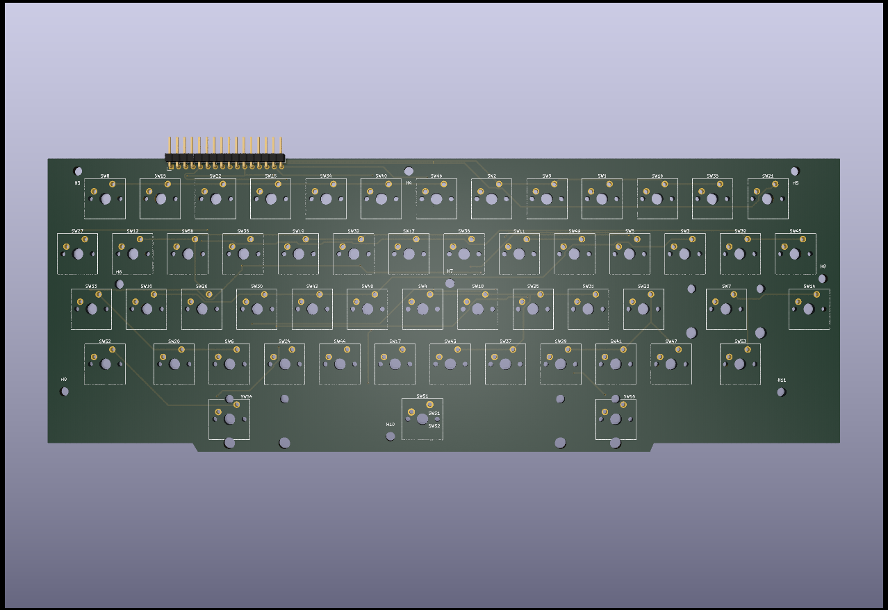

# Reproduction Keyboard for Dragon 32 and 64 #

This project provides the designs for a reproduction keyboard
to fit the Dragon 32 and 64 home computers. The design uses modern
Cherry MX compatible switch mounts to facilitate the easy use of
readily available keycaps.

## Status ##

The first draft of the board has been produced for testing

The good bits:
* The layout fits the keyboard aperture in the case
* The height of the board appears to be correct at 20mm higher than
the original

The bad bits:
* The first draft is 5.3mm too wide - but the layout is all referenced
from the top left of the board and this is correct. The only fault is
the right hand edge and the right hand mounting point

## Changes to the original ##

The keyboard matrix includes a diode alongside each switch to 
remove ghosting issues. This isn't strictly necessary but if
you want to utilise a cheap MCU like the atmega32u4 to convert
the keyboard to USB HID, you are going to need those diodes.

If you decide not to use them you will need to bridge the pads
for each diode position, this then replicates the original
keyboard matrix

### Using a microcontroller for USB ###

The project includes design files for use with the "Keyboard
Firmware Builder" website - this generates a binary file to
program a microcontroller. The design expects the rows to be
wired to the "Bx" pins and the columns to be wired to the
"Dx" pins.

The Firmware Builder website can be found here:
[Keyboard Firmware Builder link](https://builder.mrkeebs.com/)

### Extra keys ###

The original keyboard utilises an 8u wide spacebar but these
are more just a bit tricky to find in modern fittings, the next
best alternative is a 6u wide spacebar which leaves gaps for
two more keys, wiring the keyboard to accept extra keys is
simple enough and the original matrix has space for four more
keys. The original ROMs do not include scanning for those extra
unused keys so they won't do anything without modifications to
the ROM coding. For emulation purposes it is trivial to map the
extra keys to be useful (I suggest using them as modifiers to
really expand the range of keypresses or macros that can be
operated).

The layout of the keyboard can be quickly prototyped using
another online tool called the "Keyboard Layout Editor", you
can access it here: [Keyboard Layout Editor link](http://www.keyboard-layout-editor.com/?fbclid=IwAR0KAMezcl8_ZXLS8Ygmnt5tV90nPUaG68bI-OjukuRIi-xNhSF8OInGqlg##@@_x:0.5&c=%231c1a1a&t=%23e8e8c8&p=R1&sm=cherry&sb=cherry&st=MX1A-G1xx&a:5&fa@:4&:6%3B%3B&=!%0A1&=%22%0A2&=%23%0A3&=$%0A4&=%25%0A5&=%2F&%0A6&='%0A7&=(%0A8&=)%0A9&=%0A0&=*%0A%2F:&=%2F=%0A-&_a:7&fa@:2%3B%3B&=BREAK%3B&@_fa@:6%3B%3B&=%E2%86%91&_fa@:8%3B%3B&=Q&=W&=E&=R&=T&=Y&=U&=I&=O&=P&=%2F@&_fa@:6%3B%3B&=%E2%86%90&=%E2%86%92%3B&@_x:0.25%3B&=%E2%86%93&_fa@:8%3B%3B&=A&=S&=D&=F&=G&=H&=J&=K&=L&_a:5&fa@:4&:6%3B%3B&=+%0A%2F%3B&_a:7&w:2%3B&=ENTER&_fa@:2%3B%3B&=CLEAR%3B&@_x:0.25&fa@:4%3B&w:1.5%3B&=SHIFT&_fa@:8%3B%3B&=Z&=X&=C&=V&=B&=N&=M&_a:5&fa@:4&:6%3B%3B&=%3C%0A,&=%3E%0A.&=%3F%0A%2F%2F&_a:7&w:1.5%3B&=SHIFT%3B&@_x:2.75&w:8%3B&=)

The link includes all of the original design settings but
you can also find the settings as a config file in this
repository.

The reproduction boards I've designed have the potential to 
utilise full 8-bit character set codes (through external
character generator roms and additional control lines to
the VDG), where this is done it would be necessary to use
the modifier keys to access the additional characters in
much the same way as the petscii set on vintage Commodore
computers.

## Keycaps ##

By using standard MX switches the range of key caps readily
available is immense. Brand new ready made sets are cheap
enough but keep in mind that the position of some characters
on the Dragon keyboard is non-standard (such as brackets 
appearing on the 8 and 9 keys instead of 9 and 0). You also have
a small problem with the break and clear keys as these are not
standard (yes there is a "pause break" that comes close).

Most key cap sets are also profiled differently for each row
of the keyboard, it isn't a particular problem but some keys
are in very different positions - such as the arrow keys so
the profile won't look or feel right for those keys compared
to others on the same row.

If however you are getting your keycaps fabricated there are
options to have the same profile for all of the keys **and**
have the right symbols on each key.

## Projection ##

The overall projection height (from pcb to the top of the key)
on the original keyboard is nearly 2cm more than you get with
modern keys and keycaps. If you put those in a stock case the
keys will actually be below the level of the keyboard surround.

Overcoming the difference in height needs the pcb to sit higher,
the simplest option (at the moment) is to use two layers of
boards. The first sits at the normal height and uses the original
mounting points. The second board is mounted to the first using
spacers (the pcb design includes holes for M5 sized spacers to be
mounted already).

To make the keyboard really robust it should also have a
stabilising frame above the PCB, this clips all of the switches
together into a single unit, in a similar way to the original
hi-tek switches.
